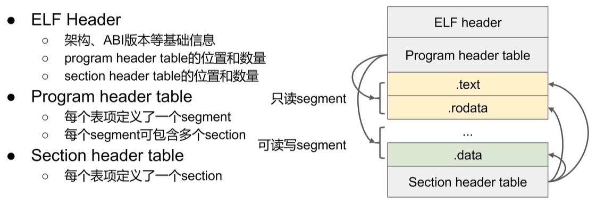
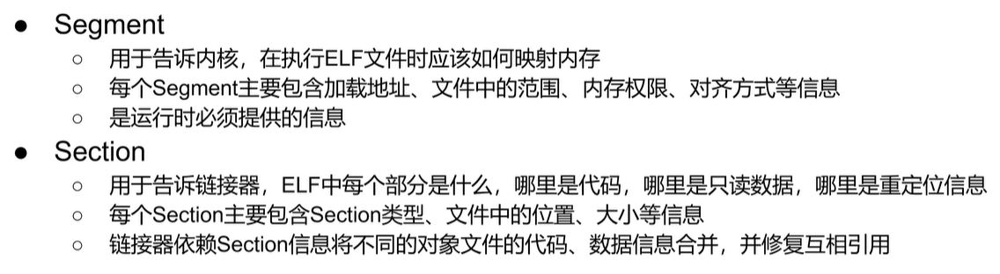
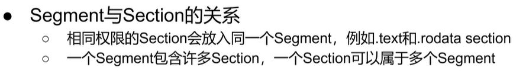
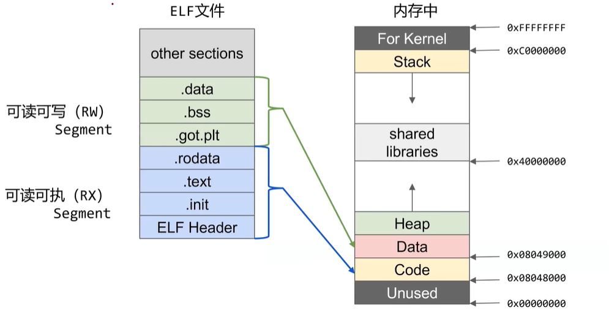
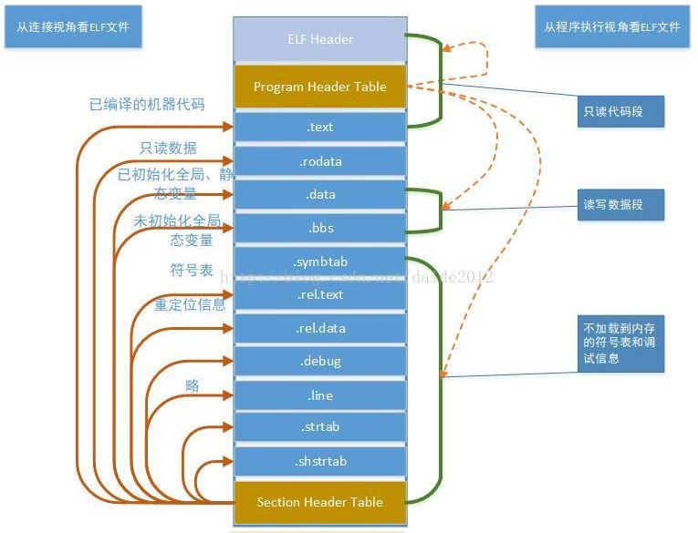

# ELF

原本想学习objdump和readelf如何使用，但细想这只是linux系统下的两个工具，其本质是用于分析可执行文件的格式和内容，还不如把elf的格式理清楚，知道这两个工具能做什么事，在需要分析的时候再查手册也不迟，没比要花时间记住这些命令参数。

## 何为ELF

Linux系统下一种常见的二进制文件格式，诸如可执行文件、可重定向文件、动态库，都是这种文件格式。我们写得代码，经过编译后都转变成这种格式。

## ELF文件格式

ELF文件格式如下图：

这里有两个概念需要解释，Section和Segment。

### Section

ELF有一个Header，他的内容会分成很多Section，比如代码段是.text，只读数据段是.rodata，当然还有其他很多Section，有一个Section Header Table记录各个Section的位置和长度，以及其他的一些信息。

### Segment

Segment是对ELF文件内容更粗粒度的划分，通常在程序运行期具有相同属性的Section，会被分为同一个Segment，比如.text和.rodata都是只读的，所以会被分为同一个Segment。文件中有一个Program HeaderTable记录了各个Segment的位置和长度及其他信息。

### 为什么有Section和Segment？

Section是文件内容的划分，Segment是程序运行时的划分。因为当程序被装载到内存后，内核将二级制可执行程序映射到虚拟内存空间时，并不关心一个Section是数据还是代码，只需要知道某段内容的属性是可读还是可写，粒度不需要向Section划分的那么细。

## 完整的一个ELF文件布局

## 其他

可通过objdump和readelf工具查看elf文件的内容和信息。

学习《程序员的自我修养》，掌握程序的链接、装载过程。
